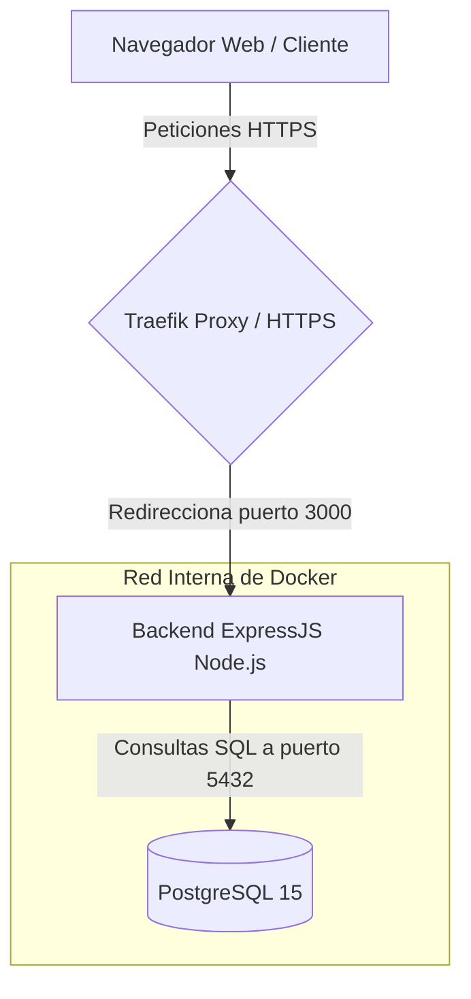
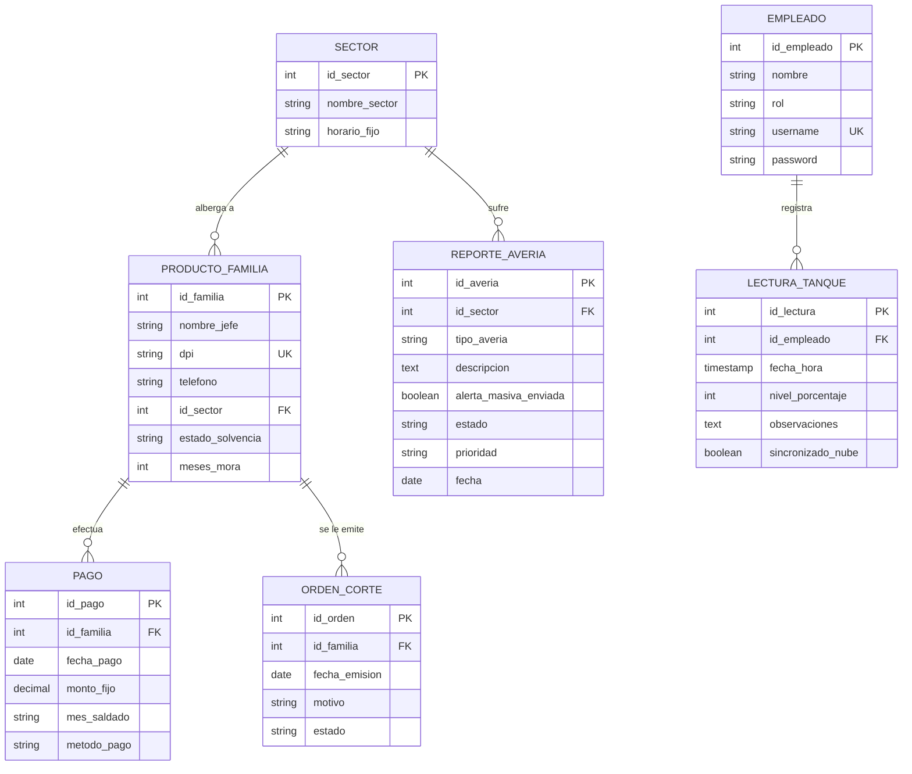
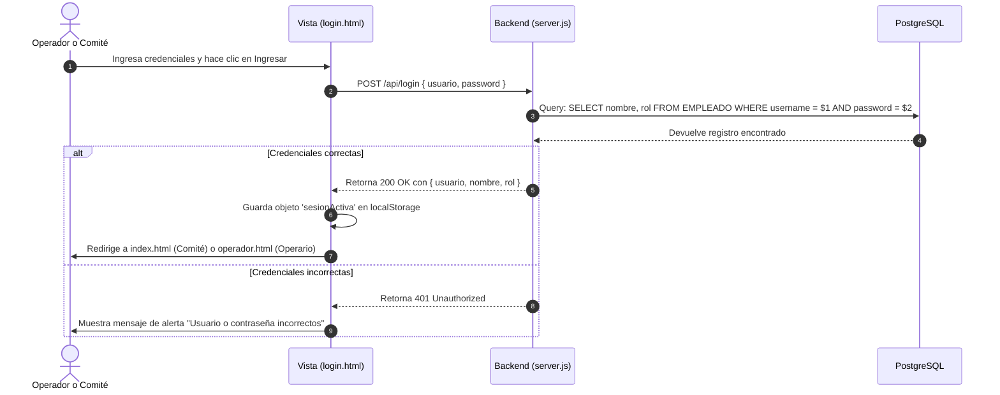
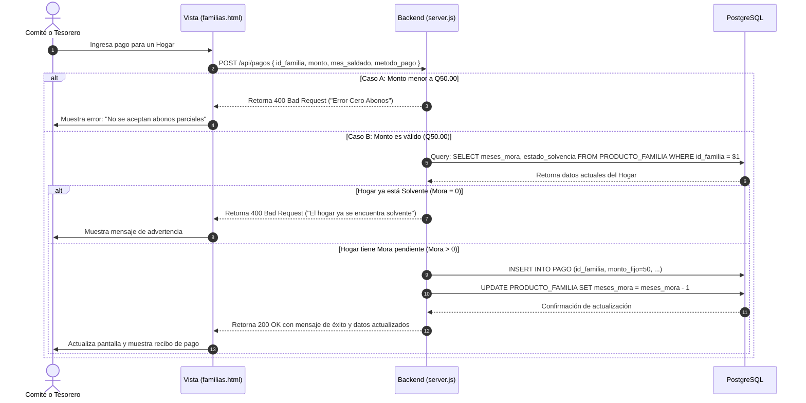

# Proyecto Final: Análisis de Sistemas I
## Sistema de Gestión de Agua San Miguel

Este documento constituye la documentación técnica, de arquitectura, de usuario y de validación oficial para el **Sistema de Gestión de Agua San Miguel**. Ha sido diseñado para cumplir con la rúbrica de evaluación de la cátedra de **Análisis de Sistemas I (7mo Semestre, UMG)**.

---

### 1. Datos generales del proyecto
Esta sección identifica formalmente el proyecto y establece el marco general de referencia y sus responsables.

* **Nombre del proyecto:** Sistema de Gestión de Agua San Miguel
* **Nombre del cliente:** Comité de Agua Potable de la Comunidad de San Miguel, San Miguel Petapa, Guatemala.
* **Nombre del proveedor:** Grupo de Desarrollo - Universidad Mariano Gálvez de Guatemala.
* **Identificación del contrato o acuerdo marco:** Proyecto Académico Final - Cátedra de Análisis de Sistemas I.
* **Fechas clave:**
  * **Fecha de inicio del proyecto:** 10 de febrero de 2026
  * **Fecha de entrega acordada:** 04 de junio de 2026
  * **Fecha efectiva de entrega:** 04 de junio de 2026
* **Responsables principales:**
  * **Project Manager:** Christian Cachín
  * **Líder técnico:** Christian Cachín
  * **Contacto del cliente:** Catedrático del curso / Representante del Comité de San Miguel
* **Versión del producto:** `v1.0.0` (Estable)
* **Estándar de versionado:** Versionado Semántico (SemVer) bajo la nomenclatura `Mayor.Menor.Parche`.

---

### 2. Alcance del proyecto entregado
Descripción del alcance real implementado y desplegado para el sistema en comparación con los requerimientos iniciales.

#### Objetivo general del proyecto
Desarrollar e implementar un sistema digital automatizado que centralice la gestión del suministro y cobro de agua potable en la comunidad de San Miguel, garantizando un control estricto sobre la morosidad de los habitantes mediante políticas inquebrantables de recaudación, facilitando canales rápidos de reporte de averías, gestionando los turnos y horarios de distribución del agua por sectores, y permitiendo el monitoreo del nivel de reserva de agua de los tanques principales.

#### Funcionalidades entregadas
* **Módulo de Autenticación y Control de Accesos (Login por roles):**
  * Acceso diferenciado para **Comité** (Administrador con privilegios totales) y **Operador/Operario** (Privilegios de lectura y registro de lecturas/averías).
  * Acceso público de **Consulta para Habitantes** mediante teléfono o DPI (sin necesidad de contraseña) para verificar su saldo, mora y los horarios de agua de su sector.
* **Módulo de Gestión de Familias y Habitantes:**
  * Registro de jefes de hogar con su correspondiente DPI, teléfono, sector de residencia y estado financiero inicial.
  * Monitoreo en tiempo real del estado de solvencia (`Solvente`, `Mora`).
* **Módulo de Sectores y Distribución de Agua:**
  * Catálogo de sectores geográficos de la comunidad (Centro, Norte, Sur, etc.).
  * Programación y visualización de horarios fijos y días de suministro (turnos de agua) para cada sector.
* **Módulo de Registro de Pagos (Regla Estricta de "Cero Abonos"):**
  * Validación obligatoria en el backend de que **toda transacción sea exactamente de Q50.00** (costo de la cuota mensual fija).
  * Rechazo absoluto de abonos parciales (menores a Q50.00).
  * Actualización en cascada del estado financiero del hogar: cada pago recibido reduce en 1 la cantidad de meses de mora; si la mora llega a 0, el habitante pasa automáticamente a estado `Solvente`.
* **Módulo de Reporte de Averías:**
  * Registro de averías o rupturas de tuberías en la red de distribución.
  * Asignación de prioridad (`Baja`, `Media`, `Urgente`), estado de reparación y envío simulado de alertas masivas a los sectores afectados.
* **Módulo de Monitoreo de Tanques (Lectura de Niveles):**
  * Registro del porcentaje de llenado de los tanques de agua de la comunidad.
  * Historial de observaciones y bandera de sincronización con servicios en la nube para modo offline.
* **Proceso de Facturación Automática Mensual:**
  * Simulación automática que, al ejecutarse, carga un mes adicional de mora y cambia a estado `Mora` a todas las familias de la base de datos al inicio de un nuevo periodo.

#### Requisitos no funcionales cubiertos
* **Despliegue y Orquestación:** Todo el sistema se ejecuta de manera modular dentro de contenedores **Docker** mediante `docker-compose`.
* **Seguridad y Cifrado:** Exposición a producción protegida por el proxy inverso **Traefik**, garantizando la redirección automática de HTTP a **HTTPS** utilizando certificados SSL válidos y gratuitos emitidos automáticamente por **Let's Encrypt**.
* **Documentación Interactiva:** La API REST expone de manera interactiva sus endpoints mediante **Swagger UI**.

#### Elementos excluidos y justificación
* **Pasarela de pago electrónico en línea (Visa/Mastercard/BI):** Excluido por los costes financieros de afiliación de pasarelas de pago y la naturaleza rural/comunitaria del comité de agua. Se solventa mediante el registro digital en la oficina de tesorería del comité tras recibir el pago en efectivo.
* **Envío real de alertas SMS o correos electrónicos masivos:** Excluido para evitar gastos operativos de integración con APIs comerciales de terceros como Twilio o SendGrid. Se implementó una lógica de simulación en la interfaz que indica al operador que la alerta masiva ha sido propagada.

---

### 3. Entregables

#### Código y ejecutables
* **Repositorio del código fuente:** [https://github.com/ccachin/sistema-gestion-agua-san-miguel.git](https://github.com/ccachin/sistema-gestion-agua-san-miguel) (Rama: `main`, Versión: `v1.0.0`).
* **Lanzamiento de contenedores:** Archivo [docker-compose.yml](file:///C:/Users/cachi/OneDrive/Desktop/UMG/7%20SEMESTRE/AN%C3%81LISIS%20DE%20SISTEMAS/proyecto/SISTEMA-DE-GESTION-DE-AGUA/docker-compose.yml) configurado con el servicio `app` (Node.js/Express) y el servicio `db` (PostgreSQL 15 Alpine).

#### Base de datos y credenciales
* **Script de Inicialización:** Archivo [BD_Script_Simulado.sql](file:///C:/Users/cachi/OneDrive/Desktop/UMG/7%20SEMESTRE/AN%C3%81LISIS%20DE%20SISTEMAS/proyecto/SISTEMA-DE-GESTION-DE-AGUA/BD_Script_Simulado.sql) con la estructura del esquema relacional y la inyección de datos semilla (sectores, empleados iniciales y familias de prueba).
* **Accesos y cuentas del sistema:**
  * **Rol Comité (Administrador):** Usuario: `admin` | Contraseña: `admin123`
  * **Rol Operario (Operador):** Usuario: `operario` | Contraseña: `op123`
  * **Rol Tesorero:** Usuario: `tesorero` | Contraseña: `tes123`
  * **Consulta de Habitante de Prueba:** DPI: `3456 78901 0101` o Teléfono: `5566-7788` (para consultar estado de cuenta).

#### Especificación de APIs y Colección de Pruebas
* **Swagger UI:** Accesible localmente en `http://localhost:3000/api/docs`.
* **Colección de Postman:** Exportada en el archivo [API_Sistema_Agua_San_Miguel.postman_collection.json](file:///C:/Users/cachi/OneDrive/Desktop/UMG/7%20SEMESTRE/AN%C3%81LISIS%20DE%20SISTEMAS/proyecto/SISTEMA-DE-GESTION-DE-AGUA/API_Sistema_Agua_San_Miguel.postman_collection.json) conteniendo las pruebas automáticas para cada una de las rutas expuestas por el servidor.

---

### 4. Requisitos técnicos cumplidos

* **Lenguajes de programación:** 
  * **Backend:** Node.js (JavaScript).
  * **Frontend:** HTML5, CSS3 (diseño responsivo y estilizado moderno), JavaScript Vanilla (ES6+).
  * **Base de datos:** SQL (Sintaxis estándar PostgreSQL).
* **Frameworks y dependencias de Node.js:**
  * `express` v4.22.2 (Enrutamiento y API REST).
  * `pg` v8.21.0 (Driver de conexión y consultas PostgreSQL).
  * `cors` v2.8.6 (Habilitación de peticiones de origen cruzado).
  * `dotenv` v16.6.1 (Gestión de variables de entorno seguras).
  * `swagger-ui-express` v5.0.1 (Autogeneración y renderizado de la documentación Swagger).
* **Infraestructura de contenedores y servicios:**
  * **Motor de Contenedores:** Docker Engine v24+ y Docker Compose v2+.
  * **Imagen de Base de Datos:** `postgres:15-alpine` (Huella ligera de memoria y seguridad reforzada).
  * **Proxy y Servidor Web Reverso:** Traefik v2.10 con redirección automática HTTPS y renovación automática de certificados SSL vía ACME Let's Encrypt.
* **Criterios de seguridad cumplidos:**
  * Aislamiento de variables críticas de conexión a base de datos mediante archivos `.env` (no expuestos en el código).
  * Validación del lado del servidor de parámetros obligatorios y montos de dinero para proteger la integridad financiera.

---

### 5. Ambientes de despliegue y arquitectura de red

El proyecto está diseñado para funcionar en un entorno local de desarrollo, una arquitectura híbrida pública mediante túneles seguros y, finalmente, despliegues 24/7 en servidores públicos en la nube.

#### 5.1 Entorno de desarrollo local
* **Servidor Local:** Ejecución de Node.js con `nodemon` en el puerto `3000`.
* **Base de Datos:** PostgreSQL local expuesta en el puerto estándar `5432` o Docker expuesto en `5433` para pruebas independientes.
* **Cliente de Base de Datos:** pgAdmin 4 conectado localmente.

#### 5.2 Despliegue híbrido actual (Local + Dominio Público vía Cloudflare Tunnel)
Para la presentación del proyecto y las pruebas públicas UAT desde cualquier dispositivo, se implementó una arquitectura híbrida que no requiere abrir puertos en el router del hogar ni pagar hosting en la nube:
* **Dominio Registrado:** `aguasanmiguel.site` (Adquirido en Namecheap).
* **Servidores de Nombres (DNS):** Administrados en Cloudflare (apuntando a `garret.ns.cloudflare.com` y `raina.ns.cloudflare.com`).
* **Canalización y SSL:** **Cloudflare Tunnel (`cloudflared`)** instalado como servicio de sistema en segundo plano en la PC local.
* **Flujo de Red:** 
  Cualquier dispositivo en internet accede a `https://aguasanmiguel.site` -> La petición es recibida por la red perimetral de Cloudflare (la cual gestiona el certificado SSL de forma automática y gratuita) -> El tráfico es enrutado de manera segura por el túnel cifrado hacia el puerto local `3000` de la PC -> Docker local responde con la aplicación web.
* **Ventajas:** Conectividad externa inmediata, 100% seguro (HTTPS), cero costos recurrentes y sin necesidad de configuraciones complejas de IP pública estática o NAT loopback.

#### 5.3 Guía de migración a producción 24/7 (VPS Gratuito en la nube)
Si se desea mantener el sistema activo las 24 horas del día sin necesidad de dejar encendida la computadora personal del desarrollador, se recomienda migrar a un servidor en la nube gratuito:

##### Opción A: Google Cloud Platform (GCP) - Always Free Tier
1. **Registro:** Registrarse en `cloud.google.com/free` (ofrece $300 USD de crédito inicial y cuenta gratis).
2. **Creación del VPS:** Crear una instancia en Compute Engine con la siguiente configuración gratuita recomendada:
   * **Región:** `us-central1` (Iowa), `us-east1` (Carolina del Sur) o `us-west1` (Oregón).
   * **Tipo de máquina:** `e2-micro` (2 vCPUs, 1 GB de RAM).
   * **Disco de arranque:** Disco persistente estándar (Standard Persistent Disk) de hasta 30 GB con el sistema operativo **Ubuntu Server**.
3. **Instalación de dependencias:** Conectarse vía SSH a la terminal e instalar Docker:
   ```bash
   sudo apt update && sudo apt install docker.io docker-compose -y
   sudo systemctl enable --now docker
   ```
4. **Ejecución de la App:** Descargar el repositorio y ejecutar `sudo docker compose up -d --build`.

##### Opción B: Oracle Cloud Infrastructure (OCI) - Always Free Tier
1. **Registro:** Registrarse en `oracle.com/cloud/free/`.
2. **Creación del VPS:** Crear una instancia Compute con la forma `VM.Standard.A1.Flex` (procesador ARM Ampere, asignando hasta 4 OCPUs y 24 GB de RAM totalmente gratis).
3. **Redirección del túnel:** Instalar el agente de Cloudflare Tunnel en el VPS Linux ejecutando el comando de instalación de Debian/Ubuntu provisto por el panel de Cloudflare Zero Trust (`one.dash.cloudflare.com`). Al hacerlo, el dominio `aguasanmiguel.site` apuntará de inmediato al VPS de forma automática sin realizar cambios adicionales de DNS.

---

### 6. Análisis y diseño

#### Requerimientos funcionales principales
1. **RF1 - Autenticación por roles:** Permitir a los empleados ingresar con sus credenciales y dirigir al Dashboard correspondiente según su rol.
2. **RF2 - Consulta rápida de Habitante:** Permitir a los vecinos verificar su saldo ingresando su DPI o teléfono de manera pública.
3. **RF3 - Regla de Cero Abonos:** Validar que los pagos ingresados al sistema correspondan exactamente a la cuota estricta de Q50.00.
4. **RF4 - Control de Mora y Solvencia:** Disminuir automáticamente los meses de mora del habitante al registrar un pago y cambiar su estado a "Solvente" cuando la mora sea igual a cero.
5. **RF5 - Gestión de Averías:** Permitir a los operadores registrar averías indicando sector, prioridad, descripción y estado.
6. **RF6 - Control de Tanque:** Registrar niveles de llenado del tanque principal con observaciones asociadas al operario responsable.

#### Arquitectura del sistema
El sistema implementa una **Arquitectura Cliente-Servidor Desacoplada**:
* **Capa de Presentación (Frontend):** Páginas HTML enriquecidas con estilos CSS y dinamizadas mediante JavaScript Vanilla que realizan llamadas asíncronas (`fetch`) a la API de backend.
* **Capa de Lógica de Negocio (Backend):** Servidor Express que actúa como API Gateway procesando peticiones, validando reglas de negocio, y administrando las respuestas HTTP con código de estado estandarizados.
* **Capa de Datos (Base de Datos):** Servidor relacional PostgreSQL que ejecuta sentencias SQL transaccionales y garantiza la integridad referencial de los datos.



---

#### Modelo Entidad-Relación de la base de datos



---

#### Diagrama de Secuencia: Proceso de Autenticación (Login)



---

#### Diagrama de Secuencia: Registro de Pagos (Cero Abonos)



---

### 7. Validación de entrega (Pruebas UAT)

Esta sección recopila las pruebas de aceptación de usuario (UAT) realizadas sobre el sistema para verificar el cumplimiento exacto del comportamiento esperado de la aplicación.

#### Casos de prueba ejecutados y aprobados

| ID Caso | Módulo | Descripción del Caso de Prueba | Entrada | Resultado Esperado | Resultado de la Validación | Estado |
| :--- | :--- | :--- | :--- | :--- | :--- | :---: |
| **TC-01** | Autenticación | Inicio de sesión con credenciales correctas. | Usuario: `ccachin`<br>Contraseña: `admin123` | Acceso concedido, almacenamiento del token y redirección al Dashboard de Comité. | Inicio de sesión exitoso y redirección instantánea a `index.html`. | **Aprobado** |
| **TC-02** | Autenticación | Intento de inicio de sesión con credenciales incorrectas. | Usuario: `admin`<br>Contraseña: `erronea` | Denegar el acceso con código `401 Unauthorized` y mostrar advertencia visual. | Bloqueo inmediato y despliegue del aviso en pantalla en color rojo. | **Aprobado** |
| **TC-03** | Habitantes | Consulta de estado de cuenta de habitante público. | DPI: `3456 78901 0101` | Desplegar nombre del jefe, sector, horario de agua y cantidad de meses en mora. | Despliegue correcto de la información de "Familia Cachin (Tienda)" mostrando 1 mes de mora. | **Aprobado** |
| **TC-04** | Pagos | Registro de pago menor a la tarifa fija (Intento de Abono Parcial). | ID Familia: `3`<br>Monto: `Q20.00` | Rechazar transacción con código `400 Bad Request` y mostrar mensaje de la regla "Cero Abonos". | Bloqueo en backend. Mensaje en pantalla: *"Error Cero Abonos: No se aceptan abonos parciales. La cuota estricta es de Q50.00."* | **Aprobado** |
| **TC-05** | Pagos | Registro de pago exitoso para familia en mora. | ID Familia: `3`<br>Monto: `Q50.00` | Registrar el pago de Q50.00, descontar 1 mes de mora, y actualizar el estado financiero de la familia a "Solvente". | Pago registrado con éxito. La mora de la "Familia Cachin" bajó de 1 a 0 y su estado cambió de "Mora" a "Solvente". | **Aprobado** |
| **TC-06** | Facturación | Carga masiva mensual de cuotas. | POST a `/api/facturacion/generar-mensualidad` | Incrementar en +1 la mora de todas las familias del sistema y cambiar sus estados a "Mora". | Ejecución exitosa. Todas las familias incrementaron sus meses de mora y se alertó de forma global. | **Aprobado** |
| **TC-07** | Tanque | Registro de nivel de agua por el operario. | Operario: `operario`<br>Nivel: `85%`<br>Obs: *Tanque lleno y funcionando.* | Guardar la lectura asociada al id_empleado del operario y hora del registro. | Registro almacenado en la tabla `LECTURA_TANQUE` mostrando la hora exacta y autoría del operario. | **Aprobado** |

---

### 8. Manual de uso rápido para el usuario final

#### Acceso para Comité e Inserción de Pagos
1. Abra el archivo `login.html` en su navegador o acceda a la URL del dominio seguro del VPS.
2. Ingrese las credenciales administrativas (Ej: `ccachin` / `admin123`) en la pestaña **Comité / Operario**.
3. Al ingresar, se le redireccionará al panel principal (`index.html`).
4. Para realizar un cobro, busque a la familia en la lista de hogares. 
5. Si la familia tiene una mora mayor a 0, aparecerá el botón **Registrar Pago**.
6. Ingrese el monto de **Q50.00** en el formulario de pago y seleccione el método de pago (Efectivo/Depósito).
7. Haga clic en **Confirmar Pago**. El sistema descontará la mora del vecino inmediatamente y actualizará la lista de familias.

#### Consulta rápida de estado para Habitantes
1. En la pantalla de Login, seleccione la pestaña **Habitante**.
2. Escriba el **Número de Teléfono** o el **DPI** del jefe de familia.
3. Presione el botón **Consultar mi Estado**.
4. Será dirigido a `habitante.html` donde podrá visualizar:
   * Sus datos generales de registro.
   * Su saldo actual y cuántos meses de mora debe.
   * El horario exacto y días de la semana en que su sector recibirá suministro de agua potable.
   * El estado actual de averías que se reporten en la comunidad.
